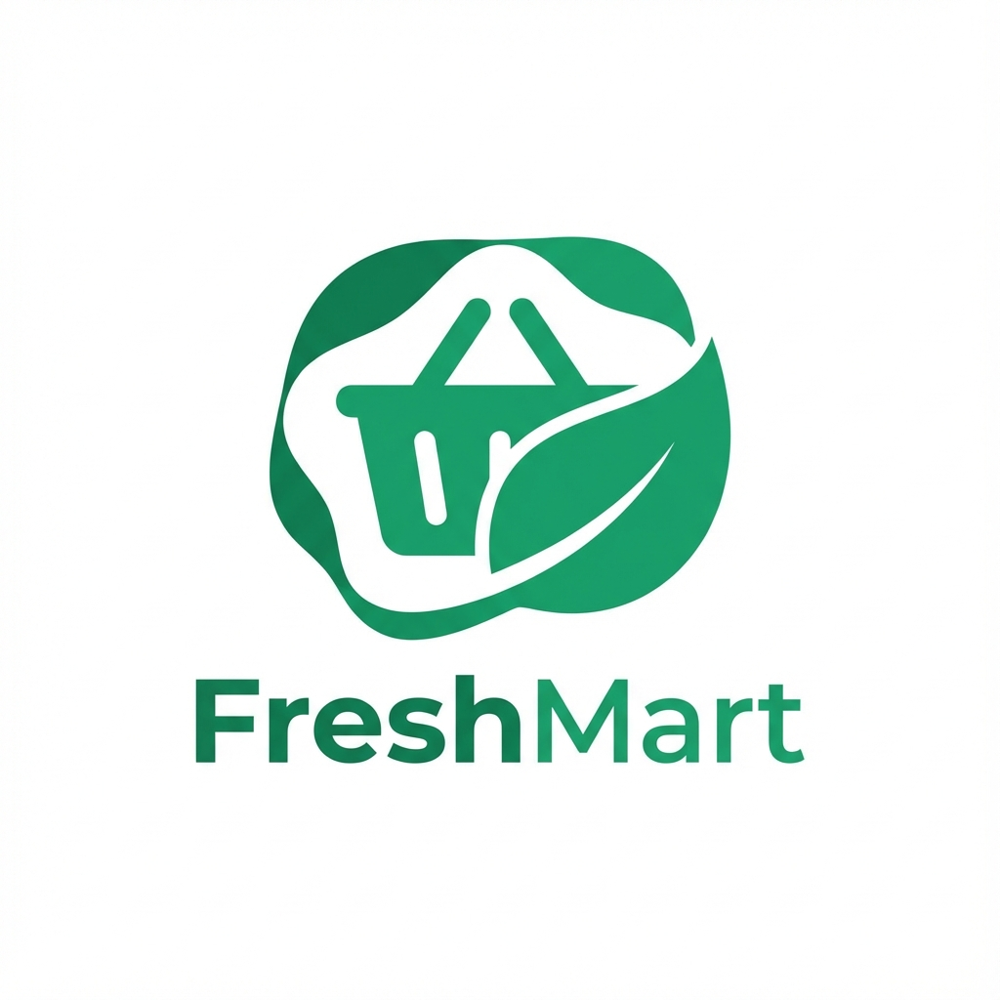

# FreshMart - Premium Online Grocery Store

<div align="center">
  
  <h1>FreshMart</h1>
  <p><strong>Premium Daily Essentials Delivered to Your Doorstep</strong></p>
</div>

FreshMart is a full-stack MERN application designed to provide a seamless and premium online grocery shopping experience. It features a modern, responsive UI, robust backend management, and a secure authentication system.

## 🌟 Unique Features

### 🎨 **Premium UI/UX**
- **Modern Aesthetic:** Clean, white-space driven design with a vibrant green color palette.
- **Dark Mode Support:** Fully integrated system-wide dark mode for a comfortable viewing experience at night.
- **Responsive Design:** Optimized for all screen sizes, from mobile phones to large desktop monitors.
- **Smooth Animations:** Powered by `framer-motion` for engaging page transitions and micro-interactions.

### 🛍️ **Smart Shopping Experience**
- **Dynamic Dashboard:** Personalized user hub showing recent orders, total spent, and recently viewed products.
- **Advanced Filtering:** Browse products by categories (Vegetables, Fruits, Dairy, etc.) with instant filtering.
- **Real-time Search:** Find products instantly with a responsive search bar.
- **Cart Management:** Fully functional cart with quantity adjustments and live total calculation.

### 📦 **Order Management**
- **Order History:** comprehensive list of all past orders with detailed breakdowns.
- **Live Status Tracking:** Track orders through 5 stages: `Pending` → `Confirmed` → `Processing` → `Shipped` → `Delivered`.
- **Order Cancellation:** Users can cancel orders before they are processed.
- **Reorder Functionality:** Quickly re-add items from a past order to the cart with one click.

### 🛡️ **Admin Dashboard**
- **Visual Analytics:** At-a-glance view of Total Sales, Total Orders, and User Count.
- **Product Management:** Add, edit, and delete products with support for multiple images per product.
- **Order Control:** View all customer orders and update their status to keep users informed.
- **User Management:** Monitor registered users and their roles.

### 💳 **Secure Checkout**
- **Multiple Payment Options:** Support for both **Cash on Delivery (COD)** and **Online Payments** (Razorpay integration).
- **Address Management:** Save and manage shipping addresses for faster checkout.
- **Order Summary:** Clear breakdown of subtotal, shipping fees, and taxes before purchase.

---

## 🚀 Tech Stack

### **Frontend**
- **Framework:** React 18 (Vite)
- **Styling:** Tailwind CSS
- **State Management:** React Context API
- **Routing:** React Router DOM v6
- **Animations:** Framer Motion
- **Icons:** Lucide React
- **HTTP Client:** Axios

### **Backend**
- **Runtime:** Node.js
- **Framework:** Express.js
- **Database:** MongoDB (Mongoose ODM)
- **Authentication:** JWT (JSON Web Tokens)
- **Password Hashing:** Bcrypt.js
- **Image Storage:** Cloudinary (optional configuration)

---

## 🛠️ Installation & Setup

### 1. Clone the Repository
```bash
git clone https://github.com/Raghu1611/freshmart.git
cd freshmart
```

### 2. Backend Setup
Navigate to the backend directory and install dependencies:
```bash
cd backend
npm install
```

Create a `.env` file in the `backend` folder:
```env
PORT=5000
MONGODB_URI=your_mongodb_connection_string
JWT_SECRET=your_super_secret_key
STRIPE_SECRET_KEY=your_stripe_key (optional)
```

Start the backend server:
```bash
npm start
```

### 3. Frontend Setup
Open a new terminal, navigate to the frontend directory, and install dependencies:
```bash
cd frontend
npm install
```

Start the development server:
```bash
npm run dev
```

---

## 🔑 Default Admin Credentials
To access the Admin Dashboard, use the following credentials (seeded automatically):
- **Email:** `admin@freshmart.com`
- **Password:** `admin123`

---

## 📸 Screenshots

| **Home Page** | **Dark Mode** |
|:---:|:---:|
| *Modern & Clean Layout* | *Sleek Dark Theme* |

| **User Dashboard** | **Admin Panel** |
|:---:|:---:|
| *Personalized Stats* | *Full Control Center* |

---

## 🤝 Contributing
Contributions are welcome! Please feel free to submit a Pull Request.

## 📄 License
This project is licensed under the MIT License.
